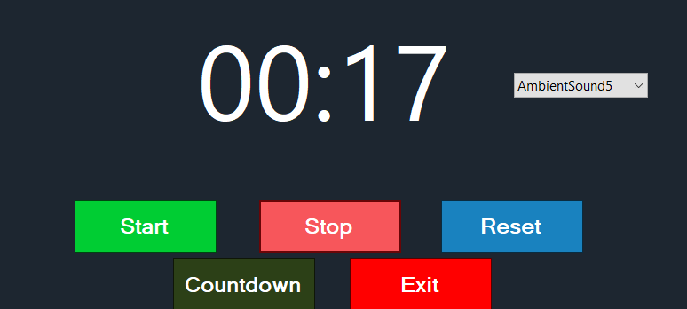
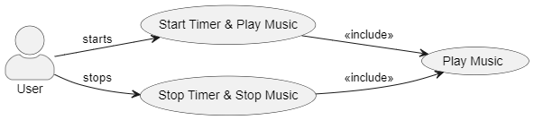

# Mediation App

*By [Justas Jokubauskas](https://github.com/Justaz17 "Justas Jokubauskas") and [Adam Carr](https://github.com/realadamcarr "Adam Carr")*

A WinForms application that allows users to meditate for a set amount of time. The user can select the amount of time they want to meditate for and the app will play a sound when the time is up. The user can also select a background theme and a sound to play when the time is up.

> Screen Shot 1

## Requirements

- [C#](https://docs.microsoft.com/en-us/dotnet/csharp/ "C#") 9.0: The programming language used to develop the application.
- [Visual Studio 2022: Community Edition](https://visualstudio.microsoft.com/vs/community/ "Visual Studio 2022: Community Edition"): The integrated development environment used to develop the application.

## Use cases

> Use Case Diagram

### Justas

1. User can start and stop timer && plays music.
2. User can Reset Timer.
3. When timer is done, system will display Time Meditated and store to a file.
4. User can see a list of Music.
5. User can Select CountdownTimer.

### Adam

1. User can select between seconds and minutes.
2. User can select between different sounds.
3. User can select between different background Themes.
4. When Time is up, user can see a pop up message for session time.
5. timer changes when the countdown has stopped

